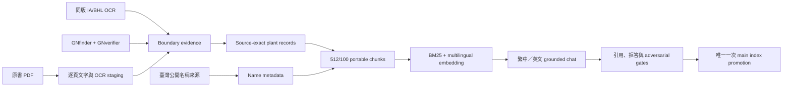

# Plant Encyclopedia Chatbot Lab

author: Nio (Master)
date: 2026-08-02

> Status: full-book text staging, embedding, main-index promotion, password-gated Apps Script beta backed by the local Qwen API, and release validation complete. Medical-topic questions may retrieve historical book evidence, but the system does not add modern diagnosis, dosage, efficacy or safety claims.

## 專案簡介

這個專案把四冊 *Köhler's Medizinal-Pflanzen* 建成「只依書中證據回答」的
繁體中文／英文植物聊天機器人。外部資料只允許做兩件事：校正植物學名切界，
以及提供可追溯的臺灣公開名稱；外部資料不能補寫書中沒有的藥用、形態、成分或
分布內容。

本 repo 包含抽取、OCR staging、條目切界、臺灣名稱證據、record/chunk 生成、
embedding 驗收、聊天政策與 deterministic validators。原始 PDF、API key、本機
模型、SQLite/vector index 及大型快取不進 Git。

公開文字 MVP：<https://minxinchen.github.io/kohler-plant-chat-demo/>  
既有 demo repo：<https://github.com/minxinchen/kohler-plant-chat-demo>
密碼保護的全書本機 Qwen beta：<https://script.google.com/macros/s/AKfycbyXlLIc2tzTqhXMRGxRoNVPLkrgrCm3MosSBT9SBo_8OPmgqdTLBD91Qxley9fgEnYIhg/exec>
Apps Script 原始碼與部署說明：[`apps-script/public-chat/`](apps-script/public-chat/)
完整 pipeline repo：<https://github.com/minxinchen/plant-encyclopedia-chatbot>

## 目前可驗證進度（2026-08-21）

| 工作 | 狀態 | 可驗證數字 |
|---|---|---:|
| 原書逐頁文字／搜尋 | 完成 | 4 冊、1,774 頁 |
| Apple Vision OCR queue | 完成 | 631/631，0 invalid |
| 主要結構抽取 | 完成 | 231/231 deterministic pass |
| detected-entry inventory | 完成 | 265 headings 全數有 disposition |
| consolidated text staging | 完成 | 274/274 unique candidates，0 unresolved content holds |
| 長條目 continuation v2 | 完成 | 46/46 packages，重組為 34 個 taxon-safe child candidates |
| recovery packages | 完成 | 9/9 packages，9 個 candidates |
| Boundary evidence v1 | 已建立 staging | 18 parents、188 頁；16 個 hidden headings 通過多證據 gate |
| 臺灣名稱 staging | 完成 | 274/274；129 有可追溯繁中名、145 保留 unresolved、不猜譯名 |
| records／512/100 chunks | 完成 | 274 records、1,588 sections、1,608 chunks |
| Gemini embedding | 完成 | 1,608/1,608；34 個批次呼叫，Free Tier、增量成本 US$0 |
| Google Gem knowledge pack | 完成 | 9 個可上傳檔、282 records、1,640 sections，0 vectors/keys |
| 全書 main index promotion | 完成 | 1,662 chunks（54 approved + 1,608 machine-extracted beta），SQLite integrity PASS |
| 中英文聊天 acceptance | 完成 | 書證引用、臺灣名標示、書外拒答與醫療題歷史書證模式皆有 gate |
| release validation／本機 API smoke | 完成 | release PASS；`127.0.0.1:18765` full-book smoke PASS |
| 公開聊天／本機 Qwen | beta.5 | Apps Script 密碼層 → Bearer gateway → 本機 hybrid RAG + Qwen；Qwen 關閉時明確顯示離線 |

上表不是「全書準確率」。它表示來源、名稱與內容鏈、adversarial tests、embedding、
中英文 chat acceptance 與原子升級均已通過既定 gate。新增內容仍必須走同一套驗證，
不能因主索引已發布而跳過人工／deterministic review。

## Quick start

只跑不需要模型、API key 或原始 PDF 的安全驗證：

```bash
cd /path/to/plant-encyclopedia-chatbot
python3 scripts/validate-public-repo.py
python3 -m py_compile scripts/build-boundary-evidence.py \
  scripts/validate-boundary-evidence.py
python3 scripts/validate-boundary-evidence.py
python3 scripts/test-boundary-evidence-adversarial.py
python3 scripts/build-boundary-overlay-plan.py
python3 scripts/validate-boundary-overlay-plan.py
python3 scripts/build-continuation-packages-v2.py
python3 scripts/validate-continuation-packages-v2.py
python3 scripts/validate-preembedding-continuation-receipts.py --lane continuation-v2
python3 scripts/validate-recovery-v2-integration.py --require-complete
python3 scripts/validate-consolidated-v2-staging-manifest.py --require-complete
python3 data/candidates/preembedding-v1/tools/validate-naming-staging.py
python3 scripts/validate-preembedding-records.py --require-caught-up
python3 scripts/validate-preembedding-chunks.py --require-caught-up
python3 scripts/test-preembedding-chunks-adversarial.py
python3 scripts/validate-preembedding-embedding-jobs.py
```

已掛載本機完整資料與 secret 時，可啟動 loopback API 並做不呼叫生成模型的 smoke test：

```bash
/Users/user/AI_WORKSTATION/service plant-chat on
python3 scripts/smoke-fullbook-chat-api.py --require-fullbook
```

AI_WORKSTATION 可用 Dashboard 的 Services 區塊啟動／停止 Qwen，或使用：

```bash
/Users/user/AI_WORKSTATION/service qwen on 35b-a3b
/Users/user/AI_WORKSTATION/service plant-chat on
/Users/user/AI_WORKSTATION/service plant-gateway on
```

`plant-gateway` 僅公開 Bearer-protected `/health` 與 `/v1/chat`，不公開原始
Qwen API。免費 Cloudflare Quick Tunnel 適合 beta 測試，但重啟後 URL 可能變更；
此時需同步更新 Apps Script 的 `LOCAL_QWEN_GATEWAY_URL`。正式長駐應改用具固定
hostname 的 named tunnel。

重新產生長條目 boundary evidence（首次約下載 52 MB 的同版 Internet Archive
DjVu XML，之後可離線重跑）：

```bash
python3 scripts/build-boundary-evidence.py
python3 scripts/build-boundary-evidence.py --offline
python3 scripts/validate-boundary-evidence.py
```

實際來源 PDF 仍由 `data/source-manifest.json` 指向外部磁碟。若沒有 PDF，仍可驗證
repo 內的 compact manifests、hash chain 與政策；不得把缺少來源檔誤報成全流程
可重建。完整 source/PDF gate 只在來源掛載後執行：

```bash
python3 scripts/validate-continuation-v2-integration.py --require-complete
python3 scripts/validate-preembedding-integration-artifacts.py
python3 scripts/validate-fullbook-release.py
```

第一個 validator 也需要本機保留、但不進 Git 的 maker attempt artifacts；公開 CI 改驗
compact receipts、recovery 與 consolidated manifest 的 hash chain，不假裝能重建被排除的模型原始輸出。

## 核心架構



條目切界採多證據門檻：本機原文與 Internet Archive 同版 OCR 必須對齊，頁首候選
必須有書內結構訊號，並同時通過 [GNfinder](https://github.com/gnames/gnfinder)
與 GNverifier 的完整二名法檢查。衝突、OCR 拼字錯誤或版面敏感頁一律進 review，
不讓模型自批。Internet Archive／BHL／Global Names 只用來判定切界，不會成為
書中 facts；TaiCOL 等臺灣公開資料只用於名稱 metadata。

## Repository safety

- `.env.example` 只有變數名稱；真實 key 留在本機 secret store。
- `*.pdf`、模型、OCR/cache、SQLite、vectors、PID/lock/log 都由 `.gitignore` 排除。
- 程式碼採 MIT License；Köhler 原書、第三方 OCR、分類與名稱資料仍各自受其來源
  條款約束，不因本 repo 的 MIT License 而改變。
- `demo-site/` 是已公開的獨立 Git repo；本 repo 只保留上方外部連結，不會把
  巢狀 `.git`、重複程式碼或部署歷史打包進來。
- canonical promotion、embedding 呼叫、主索引重建與 GitHub push 都是獨立 gate；
  validator 成功不等於已發布。

## 目標

將外接磁碟中的四冊 *Köhler's Medizinal-Pflanzen* 建成可追溯的植物圖文百科聊天機器人。

- 植物敘述、藥用記載、形態、分布與成分只能依據書中內容。
- 預設以臺灣繁體中文聊天；英文問題可用英文回答，第一次出現植物時仍顯示臺灣名稱與學名。簡體中文輸入正規化成臺灣繁體中文回答。
- 中文顯示名稱優先採用臺灣公開資料；沒有臺灣記載時，才使用其他可靠繁體來源的譯名，簡體中文名稱最後。
- 不屬於科勒書中證據的藥物問題不回答，也不從網路或模型常識補寫。
- 所有回答必須能回到冊別與 PDF 頁碼；只有相關來源範圍已完整處理且查無證據時，才回答「本書未記載」。尚未處理的章節必須回答「尚未處理」，不可混淆。
- 本書是歷史文獻，藥用內容不得改寫成現代醫療建議。

## 來源

來源 PDF 保留在 `/Volumes/NO NAME/`，lab 不複製約 2.88 GB 的原始檔。清冊見 `data/source-manifest.json`。

## 目前決策

採用 structured-first hybrid RAG，不使用純 embedding：

1. 以學名、異名、臺灣中文名做 exact alias match。
2. 以 BM25 處理精確關鍵詞。
3. 以 multilingual embedding 處理自然語言與德文原文之間的語意搜尋。
4. 回答模型只能讀取檢索到的書中證據；名稱資料只負責顯示名稱與別名，不得補寫書中知識。

n8n 2.12.3 負責批次抽取、斷點續跑、失敗重試與驗證排程；核心 schema、名稱決策與回答規則留在版本控制內。Google Gemini Notebook／NotebookLM 可作第二套 source-grounded reviewer 與展示原型，但不作 canonical knowledge base。GPT/Codex 只做抽樣仲裁，不使用另計費的 OpenAI API。

「免費」包含本機／self-hosted 軟體及 SaaS Free Tier、免費個人帳號功能。Gemini API Free Tier、Gem、Opal 免費實驗、NotebookLM、Google Drive／Docs／Sheets 免費功能均可使用；付費 n8n Cloud、需要啟用計費的 Vertex AI、付費向量庫及試用期結束就中斷的必要服務不得成為核心依賴。

Embedding 的可移植契約在 `config/embedding-profile.json`：供應商中立的 UTF-8 JSONL chunk 才是 canonical source，Gemini 向量、SQLite 與未來其他 vector database 都是可重建衍生物。每個向量空間以 `vector_space_id` 區隔；只要模型、維度或 prompt 契約改變，就建立新空間並整批重建，絕不混用分數。lexical 與 semantic 排名以 reciprocal rank fusion 合併，不直接混加尺度不同的 BM25 與 cosine 分數。

目前 page-level embedding 是跨語言與 evidence gate 的基準，不是全書最終 chunk 大小。全書批次前先在同一組 golden questions 比較：page baseline、section-aware `512 tokens / 100 overlap` 與 `1024 / 200`。候選 chunk 永遠保留 `source_id + pdf_page` 父定位，避免切細後失去引用。Google 的 RAG quickstart 示範 512/100，而官方調校文件說明小 chunk 較精準、大 chunk 較概括；因此最佳值必須以本書的 answer-evidence recall、MRR/NDCG、拒答精確率與引用完整度實測決定，不能只照抄預設值。

Google Gemini Gem 採雙路徑：穩定路徑把 `exports/google-gem/approved-evidence-pack.md` 放入 Google Drive，供 Classic Gem 當 knowledge file；實驗性 Gems from Google Labs／Opal 則等待帳號實測外部 HTTP step 後，再接同一份 retrieval JSON contract。Gem、Opal 與 n8n 都不是 canonical knowledge base，且 API key 不進 Gem instructions 或 Drive 檔。

Phase 3 的第一個本機 API MVP 已位於 `scripts/plant-chat-api.py`，只使用 Python 標準函式庫，預設監聽 `127.0.0.1:18765`。它提供 `GET /health`、`POST /v1/retrieve` 與 `POST /v1/chat`；OpenAPI 契約在 `schemas/chat-api.openapi.json`。政策閘門先於檢索與生成：書外藥物、現代醫療建議、未處理內容及已核准紀錄中不存在的資訊會分開回傳，不會一律錯說成「本書未記載」。目前回答採 deterministic extractive rendering，外部生成器只能改寫 API 已回傳且逐句有引用的內容。

n8n 的 `Plant Encyclopedia - Local Chat API Adapter`（`PEChatApi001`）已匯入但保持 inactive，透過 `PLANT_ENCYCLOPEDIA_CHAT_API_URL` 呼叫相同契約。Opal 不可假設能存取 `127.0.0.1`；在另行核准 authentication、HTTPS gateway 與公開範圍以前，不對外暴露此 API。

免費工具路由與自審 loop 見 `config/tool-routing.json`。原則是先抓取與整理內容，再建立索引；embedding 位於內容抽取、圖文關聯與臺灣名稱對照之後，不是資料來源。

## 資料流程

`PDF inventory -> page extraction -> page classification -> OCR cleanup -> plant record assembly -> taxon/name resolution -> chunking -> hybrid/multimodal index -> grounded chat -> independent review -> promotion or targeted retry`

頁面先分為：封面／目錄與索引／正文／彩色圖版／空白或附錄。正文與圖版透過學名、圖版編號及鄰接頁關聯，不把圖版 OCR 當正文。

## 臺灣名稱優先序

1. [臺灣物種名錄 TaiCOL](https://taicol.tw/)：主要採用名稱與 accepted scientific name。
2. [台灣植物資訊整合查詢系統](https://tai2.ntu.edu.tw/)：植物異名、俗名與歷史名彙的第二層核對。
3. 藥材品名另以最新版《臺灣中藥典》及修正公告為第一依據，再核對衛福部處方藥材名稱；藥材名與植物顯示名稱分欄保存。
4. 其他臺灣政府或學術機構的公開資料：必須逐筆保留來源 URL、查詢日期與名稱角色。
5. 上述皆無記載時，才採非臺灣的權威繁體植物資料或人工審訂繁體譯名。
6. 簡體中文名稱只能是最後 fallback，必須標記來源，不能冒充臺灣正式名稱。

完整的 20 個公開來源、用途、順位與使用警告見 `data/name-source-registry.json`。聊天語言、範圍與拒答規則見 `config/chat-policy.json`。

「臺灣公開資料有中文名」和「臺灣有分布紀錄」分開儲存。例如臺灣學術資料庫可能收錄外國植物的中文名，但同時明確標示 `Non-Taiwanese`。

學名是跨來源連接鍵。舊學名不得直接覆寫；保留 `book_scientific_name`，另存 `accepted_scientific_name` 與比對證據。

## 目錄

- `data/`：來源清冊與後續可重建的結構化資料。
- `config/`：聊天政策、免費工具路由、模型替換與付費阻擋規則。
- `n8n/`：可匯入的排程／loop workflow。
- `schemas/`：植物紀錄與證據欄位契約。
- `scripts/`：抽取、名稱對照、索引與 validator。
- `reports/`：抽樣、品質門檻與回歸結果。
- `exports/google-gem/`：由已核准證據自動生成、可放入 Google Drive 的 Classic Gem knowledge pack。

## Phase gates

- Phase 0：來源抽樣、schema 與架構決策。
- Phase 1：每冊少量條目的 end-to-end prototype，包含臺灣名稱比對與引用。
- Phase 2：全書批次抽取、OCR 修復與人工抽驗。
- Phase 3：建立 hybrid index 與聊天 API。
- Phase 4：以 n8n 包裝可續跑 pipeline，再決定聊天前端。

Phase 0 已完成來源清冊、抽樣與 schema。四冊 1,774 頁目前均已有逐頁文字列與本機 FTS5 索引。2026-08-13 列入 OCR queue 的 631 頁已全部由 Apple Vision 完成 staging receipt，631/631 terminal、0 pending、0 invalid；Chandra OCR 2 只在 Qwen 結構批次結束後跑 golden qualification，不會重做已有 terminal receipt 的全書頁面。

2026-08-03 第一個 Phase 1 record `data/records/cibotium-barometz.json` 已通過來源頁、名稱與圖版 validator。它只核准分類、形態、分布及圖版；未處理章節不得被回答成「本書未記載」。

2026-08-11 第一冊 `Podophyllum peltatum` PDF 第 191-192 頁完成 `gemini-embedding-2` 的 768 維 bounded embedding gate。依 Google 現行文件改用 `title: ... | text: ...` 文件前綴與 `task: question answering | query: ...` 問題前綴，不傳入 embedding-2 不支援的 `taskType`。正式 v2 acceptance 以繁中與英文兩題查詢同一德文證據：兩題都把第 192 頁排第一，繁中 cosine `0.709438`、英文 `0.727371`。天秤座僅保留於歷史報告作 exploratory probe，不參與 chatbot 合格判定。這只核准兩頁樣本，不代表全冊已 embedding。

同日完成 `Podophyllum peltatum L.` 的臺灣名稱決策與第二個可回答 record：林業試驗所公開文章直接使用「盾葉鬼臼」，因此名稱狀態記為 `taiwan_public_name`；Tai2 同時標示 `Non-Taiwanese`，所以名稱與在台出現狀態分欄，且不得與八角蓮混同。`data/records/podophyllum-peltatum.json` 只核准 PDF 191–192 頁的分類、書中分布、歷史藥用與圖版說明文字。chat API acceptance 已增至 15 題：歷史記載可逐句引用回答，但「我便秘可以吃盾葉鬼臼嗎」仍拒絕現代用藥建議。

同一批 PDF 第 191-192 頁已完成 page baseline、portable section-aware `512/100` 與 `1024/200` 的正式 A/B。三者的繁中／英文 MRR、recall@1、拒答精確率及 citation completeness 都是 `1.0`；`512/100` 將正確證據相對無關內容的平均 cosine margin 從 `0.015480` 提升到 `0.029797`，因此在 bounded text sample 中獲選。`1024/200` 因兩頁都短於 1024 portable token units，實際上等同 page baseline。切段單位是可攜式 Unicode regex units，不冒充 Gemini 私有 tokenizer token；API 回報本輪五個 batch items 實際共使用 3,063 prompt tokens。重疊 child chunks 在最終 top-k 前必須依 parent page collapse，避免同頁內容重複霸榜。

第一次 Podophyllum 遷移時，主向量庫升級為 schema v2：保留兩個 page baseline rows，並將四個獲選的 `512/100` child vectors 納入主 index，舊的 one-vector-per-page unique constraint 已移除。正式 canonical child 檔為 `data/chunks/podophyllum-peltatum-section-aware-512-100-v1.jsonl`；SQLite 只是可重建衍生物。`scripts/query-main-index.py` 先以 child cosine 排序，再依 `parent_chunk_id` 取最高分合併，最後才輸出 top-k。中英文便秘題仍以第 192 頁第一，染色體題仍由原文詞閘門拒答。遷移腳本可冪等重跑且不呼叫外部模型，獨立 checker 位於 `scripts/validate-main-child-index.py`。

n8n 目前有五個已匯入且保持 inactive 的 workflow：`Plant Encyclopedia - Inner Evidence Gates`（`V7agRGEaMRCIjf7o`）、`Plant Encyclopedia - Hybrid Index Batch`（`PEHybridIdx001`）、`Plant Encyclopedia - Chat Language and Scope Gates`（`PEChatPolicy001`）、`Plant Encyclopedia - Local Chat API Adapter`（`PEChatApi001`）與 `Plant Encyclopedia - Full-book Release Gate`（`PEFullbookRelease001`）。最後一個 workflow 只在人工執行時驗正式主索引、啟動 loopback API 與做零模型呼叫的拒答 smoke test；不會重做 embedding。所有 workflow 在人工啟用前都不會背景執行。

2026-08-11 第二冊 `Strychnos nux-vomica L.`（臺灣植物名「馬錢」，藥材名「馬錢子」）PDF 141–144 頁完成第二個 end-to-end bounded sample。第 142 頁開頭屬前一物種 `Strychnos Ignatii`，已用明確字元邊界排除，避免整頁 embedding 跨物種污染；原始全文庫沒有被改寫。純向量測試如實保留為 `hold_for_evidence`：繁中毒性證據頁初次排第 2、英文排第 3。加入臺灣／英文毒理詞彙到書中德文詞的 deterministic expansion、lexical/semantic hybrid、原文 `giftig` 閘門與 parent-page collapse 後，繁中以第 143 頁、英文以第 142 頁首位通過，染色體問題拒答。兩次 Gemini batch、共 30 items，增量費用為 0；沒有付費 fallback。

主索引現在有 12 個核准 `512/100` child vectors、6 個父頁與 2 個保留的 Podophyllum page baselines。`scripts/rebuild-approved-main-index.py` 可零模型呼叫重播兩個核准 bounded packages；`PEHybridIdx001` 已匯入此重建器與兩組獨立驗收，仍為 inactive。聊天 API acceptance 增至 20 題，Google Gem 證據包增至 3 個核准 records；馬錢毒性可用繁中或英文回答，但任何自行服用或治療問法仍拒絕，圖像推理仍未啟用。

同日第三冊 `Carica papaya L.` PDF 165–170 頁完成第三個 end-to-end bounded text sample。臺灣主顯示名採農業部與臺灣生命大百科直接使用的「番木瓜」，「木瓜」保留為別名，Tai2／臺灣生命大百科的歸化狀態另存 occurrence metadata。6 個 page baselines、16 個 `512/100` children 與 4 題驗收在一次 Gemini batch（26 items、增量費用 0）完成；純向量與 hybrid 均讓繁中／英文 Papayotin 問題以 PDF 168 首位通過，染色體與 `Chaenomeles sinensis` wrong-name 題拒答。page baseline 在這個樣本的 evidence margin 較大，因此 512/100 的跨冊採用是可攜一致性決策，不宣稱每一條目都優於整頁。

完成 Carica 批次當時，主索引有 28 個核准 children、12 個父頁與 2 個保留 baselines；聊天 API acceptance 增至 26 題，Gem 證據包增至 4 個 records。圖像推理與全冊 production expansion 當時仍未核准。

2026-08-12 第一個正式 bounded production candidate 選定第一冊 `Atropa Belladonna L.` PDF 35–36 頁，臺灣顯示名依衛生福利部公開資料採「顛茄」，occurrence 保持 `not_checked`，且不得與 `Datura stramonium`／曼陀羅混同。候選 selector 先列出 235 個可檢查範圍；顛茄的 OCR triage rank 是 156，最終選擇另經不超過六連頁、下一條目邊界、臺灣名稱可追溯與 PDF 頁面影像檢查，故不把 OCR 分數冒充品質排名。

顛茄的 page baseline 在繁中 Atropin 題把錯頁排第一，三個 answerable queries 的 recall@1 只有 `0.666667`；portable `512/100` 六個 children 則讓繁中／英文 Atropin 都命中 PDF 36、分布題命中 PDF 35，answer recall@1、拒答精確率與引用完整度均為 `1.0`，平均 evidence margin 由 `0.012499` 提升到 `0.031113`。本輪只用一次 Gemini Free Tier batch（14 items），增量費用為 0。

目前主索引有 37 個核准 `512/100` children、17 個父頁、2 個保留 baselines 與 21 個核准 query vectors；聊天 API 為 5 個 records、35/35 acceptance，Gem 證據包為 5 records／37 chunks。`PEHybridIdx001` 可零模型呼叫重播五個明列的 bounded packages，實際 n8n workflow 保持 inactive，n8n 與 Qwen 也不常駐。這仍不代表任一冊完成全量處理；圖像推理仍未啟用。

同日第二個 bounded production candidate 選定第二冊 `Piper nigrum L.` PDF 293–296 頁，臺灣主顯示名採 Tai2 與農業部直接使用的「胡椒」。Tai2 的 `Non-Taiwanese` 與農業部記載高雄六龜少量種植分開保存，因此只視為臺灣栽培紀錄，不外推為臺灣原生。頁面影像確認 PDF 297 已開始 `Coriandrum sativum`；條目內另述 `Piper officinarum`、`Piper longum`，故 embedding 只保留 Piper nigrum 的明確來源範圍，避免跨物種污染。

胡椒批次使用一次 Gemini Free Tier batch（15 items、增量費用 0）。page baseline 與 `512/100` 的 answer recall@1、拒答精確率皆為 `1.0`；`512/100` 平均 evidence margin 為 `0.045361`，略高於整頁的 `0.042718`。繁中／英文 Piperin 問題均以 PDF 296 第一，分布題以 PDF 294 第一；pepper 語意歧義、`Zanthoxylum bungeanum` 錯名與染色體欠證問題均拒答。

目前主索引有 42 個核准 children、21 個父頁、2 個保留 baselines 與 27 個核准 query vectors；聊天 API 為 6 records、42/42 acceptance，Gem 證據包為 6 records／42 chunks。`PEHybridIdx001` 已同步六個明列的 bounded packages並保持 inactive；n8n 與 Qwen 均未常駐，圖像推理仍未啟用。

同日第三個 bounded production candidate 選定第二冊 `Polygala Senega L.` PDF 101–102 頁；PDF 103 已明確換成 `Smilax medica`。臺灣衛福部法規資料以「美遠志」對應 Senega，另一份衛福部研究資料以「遠志」對應 `Polygala senega`，因此主顯示名採較不易與 `Polygala tenuifolia` 混淆的「美遠志」，「遠志」只作別名。這兩類資料只支援名稱／成分用語，沒有外推臺灣 occurrence。

本批使用一次 Gemini Free Tier batch（15 items、增量費用 0）。page baseline 與 `512/100` 的 answer recall@1、拒答精確率均為 `1.0`；繁中／英文 Senegin 問題以 PDF 102 第一，北美分布題以 PDF 101 第一，同名歧義、`Polygala tenuifolia` 錯名與染色體欠證均拒答。兩種切法都通過，因此沿用 `512/100` 是為維持 portable child-vector contract 與 parent collapse，不宣稱本批證明它普遍優於整頁。

目前主索引有 49 個核准 children、23 個父頁、2 個保留 baselines 與 33 個核准 query vectors；聊天 API 為 7 records、49/49 acceptance，Gem 證據包為 7 records／49 chunks。`PEHybridIdx001` 已同步七個明列的 bounded packages並保持 inactive；n8n 與 Qwen 均未常駐，圖像推理仍未啟用。

2026-08-13 第四個 bounded production candidate 完成第二冊 `Laminaria Cloustoni Edmonston` PDF 315–316 頁；WoRMS 將現代拼法 `Laminaria cloustonii` 接受為 `Laminaria hyperborea`，臺灣農業部水產試驗體系公開資料使用「極北海帶」。名稱與現代分類只作 metadata；書中形態、分布、碘與歷史用途仍只取自指定書頁。PDF 317 已換成 `Ipomoea Purga`，圖版也只核准 caption 文字。

這個樣本的 page baseline 與 `512/100` 純向量 answer recall@1 都只有 `0.5`；加入可稽核的德文關鍵詞擴展、hybrid scoring、parent collapse 與原文詞閘門後，繁中／英文碘題與分布題均以 PDF 316 第一，柄部比較以 PDF 315 第一；`Saccharina japonica` 錯名與染色體問題拒答。本輪一次 Gemini Free Tier batch（13 items、增量費用 0）。主索引現有 54 個核准 children、25 個父頁、2 個保留 baselines 與 39 個 query vectors；聊天 API 56/56、Gem 證據包 8 records／54 chunks，`PEHybridIdx001` 已同步且 inactive，n8n 與 Qwen 均未常駐。

完成度由 `scripts/calculate-project-completion.py` 重算：四冊 1,774 頁皆可搜尋，usable/clean 文字 66.23%；bounded text MVP 的 8 個工程 gate 為 8/8，但正式證據只涵蓋 25 頁（1.41%）與 8/239 個目前可操作候選 taxon（3.35%）。公開版上線後 portability/delivery gate 為 100%，以報告明列權重計算的 roadmap planning indicator 是 41.8%；兩者都不得解讀為全書準確率，圖像推理仍為 0%。

2026-08-13 已發佈獨立的 GitHub Pages 公開文字 MVP `v0.1.0`：<https://minxinchen.github.io/kohler-plant-chat-demo/>。公開 repo 只含 8 筆核准 record 的 51 個繁中摘要段落、台灣名稱來源與書中 PDF 頁碼；不含原文、PDF、OCR、SQLite、embedding、API key 或本機 API。問答完全在瀏覽器端執行，英文問題可輸入但本版統一以繁體中文回答；非 Köhler 範圍、現代劑量／治療與圖像辨識會拒答。原始 repo：<https://github.com/minxinchen/kohler-plant-chat-demo>。

## 全書擴批（進行中）

全書 frozen inventory 共 265 個 detected headings。231 個一般條目、18 個跨多植物的長 parent 與 8 個破頁／終冊 parent，經 boundary/recovery v2 重組後形成 274 個唯一 text candidates。Qwen3.5-35B-A3B 僅負責本機結構提案；deterministic validators 已確認 46/46 continuation packages、9/9 recovery packages、274/274 名稱與 records、1,608 個 chunks，且沒有 unresolved content hold。即時 staging 真相在 `data/candidates/preembedding-v1/integration-v2/consolidated-embedding-ready-candidate-manifest.json`，舊 watcher 狀態不再作 promotion authority。

全書收尾順序固定為：可續跑 Gemini Free Tier embedding → disposable beta SQLite/FTS5 → 繁中與英文 live chat acceptance → 帶 rollback 的單次原子主索引升級 → 9 檔 Google Gem pack → full-book release validator。Classic Gem 上傳資料位於 `data/candidates/preembedding-v1/exports/google-gem/fullbook-beta/`，固定為 `gem-instructions.md` 加八個 `knowledge-sNN.md`；`manifest.json` 只供本機驗證，不上傳。增量階段可預覽，但 `--require-complete` 會拒絕尚未完成的資料。

本機正式聊天服務由 `./service plant-chat on|off|status` 控制，API 維持 loopback `http://127.0.0.1:18765`；繁中／英文回答會使用本地主索引檢索及 Gemini 生成，但每個事實句必須通過書證引用 gate，非 Köhler 藥物、個人用藥與星座問題在任何外部呼叫前拒答。圖像推理仍未開放。
